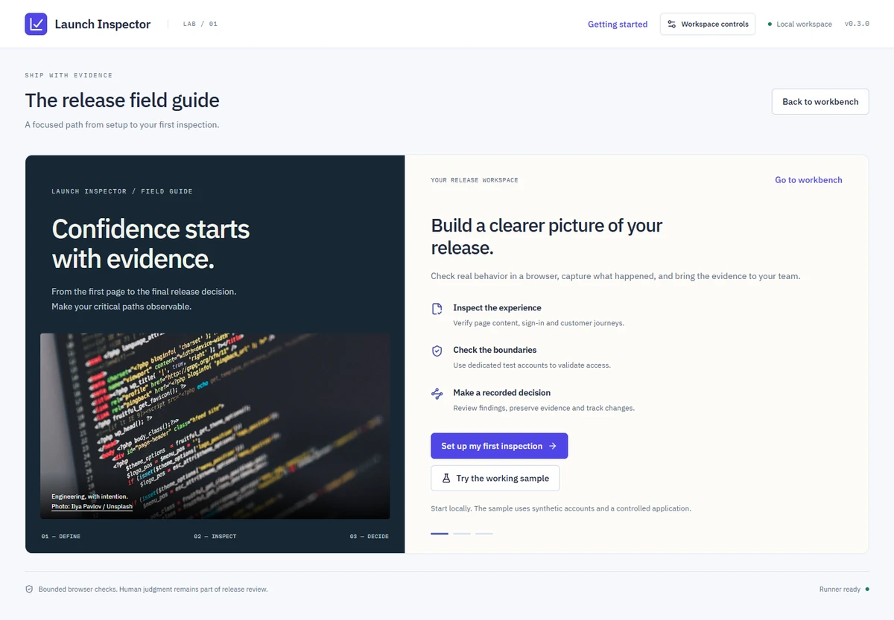
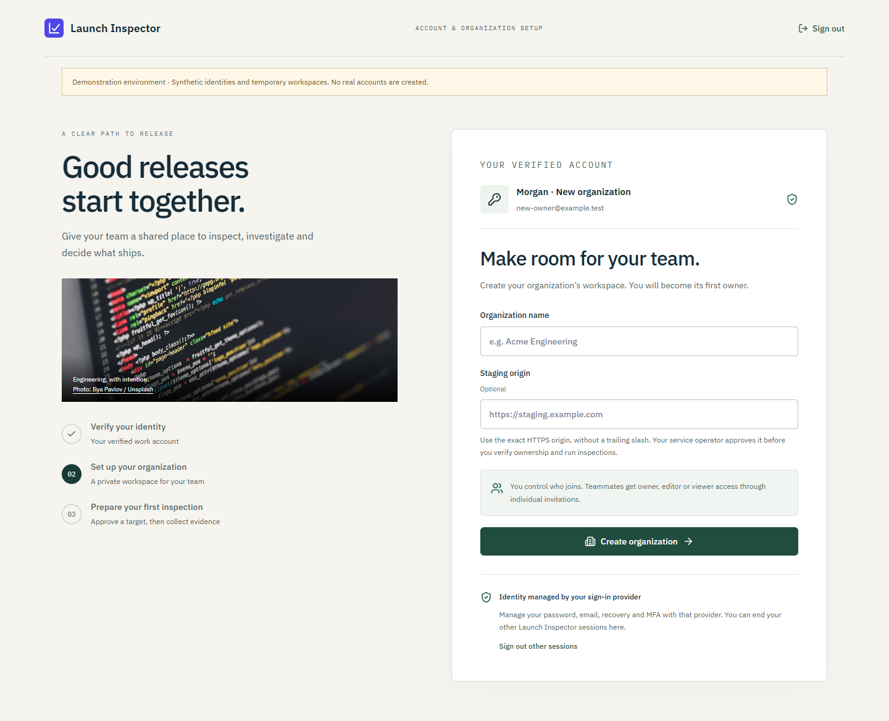
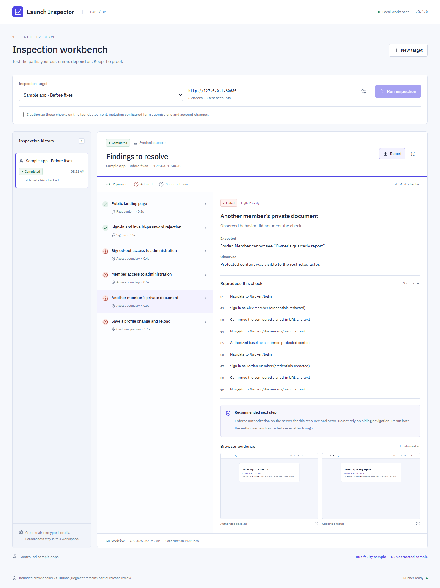
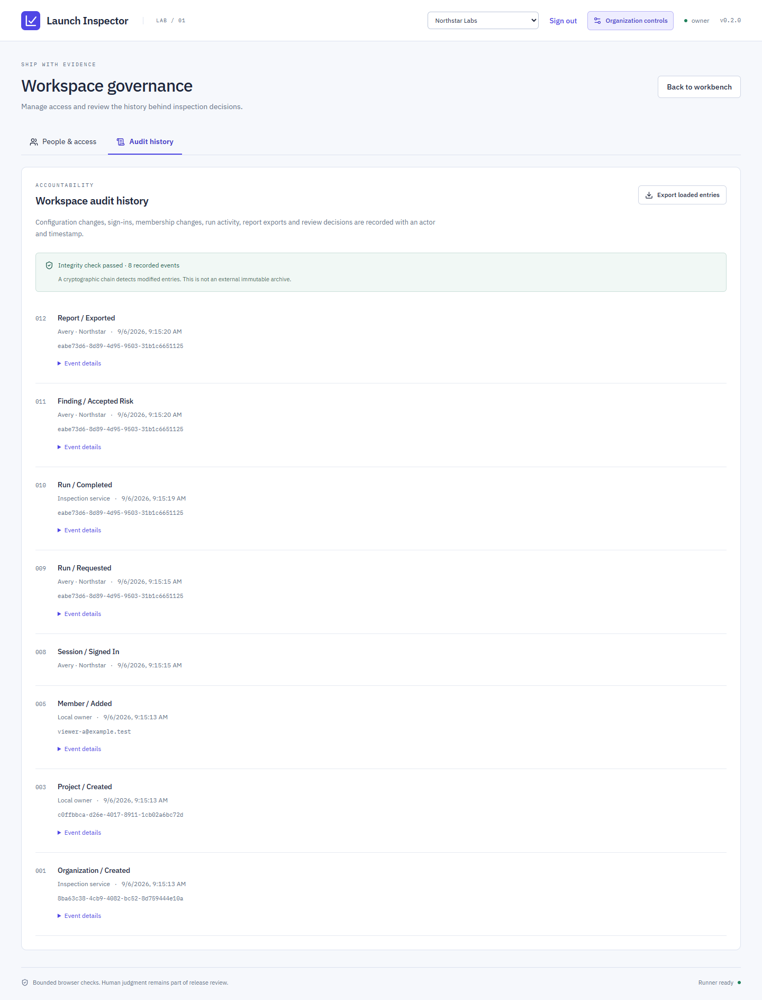

# Launch Inspector

**Browser evidence for release decisions — with separate workspaces for every customer.**

Launch Inspector checks login, account permissions and customer journeys against a running web application. It uses real Chromium sessions, records screenshots and reproduction steps, and gives teams a shared place to review the findings before release.



_Interface preview from the working local onboarding screen. This optimized version of `docs/onboarding.png` is also used in the portfolio's Work section._

Version **0.4.0** adds verified account registration, organization onboarding, expiring team invitations and personal session controls. It includes separate authenticated browser workers, target ownership verification, evidence retention and a guided first inspection. Hosted workspaces include OpenID Connect sign-in, project permissions, review decisions, audit history and tested recovery tools. Local mode remains available for individual developers. This is a working hosted pilot; production readiness still depends on your infrastructure, identity provider, operating procedures and independent security review.



_Synthetic identity in the working organization signup flow._




_Synthetic application data. The four findings shown came from actual browser checks._

## Who it helps

| Team                              | Practical use case                                                                                                          |
| --------------------------------- | --------------------------------------------------------------------------------------------------------------------------- |
| Software agencies                 | Keep each customer's staging targets, credentials, reports and reviewers in a separate organization.                        |
| SaaS engineering                  | Check that one customer cannot see another customer's protected page, then repeat the same checks after a fix.              |
| Release and QA teams              | Exercise sign-in and a saved customer journey, review evidence, and record why a finding remains open or has accepted risk. |
| Developers building with AI tools | Verify that generated login and permission flows actually behave as expected in a browser.                                  |

Checks are explicit assertions. The current release does not use an AI model, analyze source code, create pull requests or automatically repair an application. The optional repository field is a reference link.

## Capabilities

| Check               | Example                                                                                   | Evidence                                                        |
| ------------------- | ----------------------------------------------------------------------------------------- | --------------------------------------------------------------- |
| Page                | Pricing or onboarding content renders                                                     | HTTP observation, visible text and screenshot                   |
| Login               | Valid credentials reach the expected account page; optionally reject one invalid password | Signed-in path, success or rejection text and screenshots       |
| Account permissions | An anonymous visitor, member or second customer cannot see a protected marker             | Authorized baseline, followed by an isolated restricted session |
| Journey             | Edit a profile, save, reload and verify persistence                                       | Navigation, form actions and visible-text assertions            |

The dashboard includes a guided onboarding screen and supports saved targets, test accounts, run history, cancellation, evidence dialogs, Markdown/JSON exports and review notes. Review decisions keep the original observed result unchanged: accepting a risk never converts a failed check into a pass.

### Organization controls

- **Sign-in:** standard OpenID Connect authorization code flow with PKCE, signed-token verification, verified email, secure server sessions and optional required authentication context. Your identity provider enforces MFA.
- **Account onboarding:** `/signup`, `/signin`, `/join` and `/account` screens; optional self-service organization creation with verified identity, first-owner assignment and operator review of staging targets.
- **Team invitations:** owner-created, email-bound invitations with a seven-day expiry, explicit acceptance, project scopes and revocation. Copy the join link to share it; the app does not send email.
- **Personal account:** choose an organization, accept invitations, create another workspace when enabled and revoke other application sessions.
- **Customer isolation:** every project, run, screenshot, review and audit request is scoped to the signed-in user's organization and project permissions.
- **Roles:** owners manage membership and accept risk; editors configure and run assigned targets; viewers review assigned evidence. A member can belong to more than one organization with different roles.
- **Change control:** configuration, membership and finding reviews use revision checks to reject stale updates.
- **Traceability:** per-organization audit records include sign-ins, access changes, configuration saves, run events, exports and review decisions, with keyed integrity verification.
- **Target ownership:** operator-approved origins require a company-specific DNS or HTTPS proof, valid for 30 days and checked again before execution.
- **Evidence lifecycle:** owner-controlled cleanup policies, expiring previews, explicit manual deletion and per-report retention holds. Cleanup is disabled by default.
- **Execution:** hosted browsers run in a separate worker container without the controller data volume or identity secret. Each inspection uses a disposable child process and temporary directory.
- **Operations:** SQLite WAL transactions, scoped AES-256-GCM configuration encryption, bounded browser capacity, health checks, service exclusivity, backup verification and restore with session revocation.



_The organization names, identities and review notes are synthetic demonstration data._

## Run locally

Requirements: **Node.js 24.13+**, npm and a [Playwright-supported operating system](https://playwright.dev/docs/browsers). Windows and Ubuntu are tested in CI. Browser installation requires internet access and disk space.

```sh
git clone https://github.com/Billioncodes001/app-launch-inspector.git
cd app-launch-inspector
npm ci
npx playwright install chromium
npm run build
node dist/cli.js doctor
npm start
```

On Linux use `npx playwright install --with-deps chromium` to install the system libraries as well.

Open **[127.0.0.1:8795](http://127.0.0.1:8795)**. Local mode binds only to loopback and starts a controlled sample application on port **8796**. Choose **Run faulty sample** to see four seeded failures, then inspect the corrected sample to see all six checks pass. These are executed browser scenarios, not prewritten reports.

### Try the multi-company demo

After the installation and build above, run:

```sh
npm run demo:organizations
```

Open **[127.0.0.1:8798](http://127.0.0.1:8798)** and choose **Sign in with your work account**. The local test identity provider lets you choose a synthetic identity without entering a password:

| Demo identity               | Access                                                 |
| --------------------------- | ------------------------------------------------------ |
| `owner-a@example.test`      | Owner of Northstar Labs; viewer in Harbor Systems      |
| `owner-b@example.test`      | Owner of Harbor Systems                                |
| `viewer-a@example.test`     | Viewer of Northstar's assigned staging project         |
| `new-owner@example.test`    | New customer: create an organization through `/signup` |
| `new-reviewer@example.test` | Invite this identity, then accept through `/join`      |

For registration, open **[the signup demo](http://127.0.0.1:8798/signup)**, continue with a work identity and choose `new-owner@example.test`. Create a workspace and optionally record a staging origin for operator review. To test team onboarding, sign in as a Northstar owner, invite `new-reviewer@example.test`, then open the join link in another browser session and choose that identity. No real identity-provider registration or outbound email occurs in this demo.

Try an inspection, record a review, open **Organization controls**, change a synthetic member's project access, inspect the audit history and switch organizations. Demo data is temporary. This test provider intentionally allows HTTP and local targets; it is excluded from the production image and must never be used as a hosted identity provider.

## Host for multiple companies

The repository includes a Docker image, Compose deployment and Caddy TLS reverse proxy. Hosted mode requires a domain, your OpenID Connect developer application and an operator-approved target origin for each company. Set `INSPECTOR_SIGNUP=self_service` to let verified users register and create organizations; the default is `invite_only`. Configure user registration, verification and recovery in the identity provider too. New organizations can invite members immediately, but targets require operator approval and proof of control before inspections.

Follow **[Hosting and customer onboarding](docs/HOSTING.md)** for the complete setup, environment variables and role model. Follow **[Operations and recovery](docs/OPERATIONS.md)** for health checks, backups, restore, upgrade and capacity planning. Read **[Security boundaries](docs/SECURITY.md)** before a customer pilot.

The supported topology is **one controller plus one worker service on a dedicated host with persistent controller storage**, serving multiple logically isolated organizations. It is not a horizontally scalable or highly available deployment. Use a dedicated host and network egress controls for customer browser workloads.

## Configure an inspection

1. Use **Getting started** for a guided first page check, or select **New target** for the full editor. Hosted owners first open **Organization controls → Verified targets** to publish and verify a DNS record or HTTPS file. Verification expires after 30 days.
2. In the full editor, Enter an origin such as `https://staging.example.com`; hosted targets must already be approved for the organization.
3. Configure the login path, exact accessible field labels, button name, successful path and visible success text. Provide the rejection message if testing an invalid password.
4. Add disposable test accounts with stable IDs, such as `owner`, `member` and `customer-two`.
5. Add page, login, permission or journey checks. Every journey needs at least one visible-text assertion.
6. Save the target, acknowledge authorization to exercise it, and run the inspection.

The authorized account must first see the protected marker before a permission check tests a restricted account. A failed baseline cannot produce a passing permission result. Choose a specific marker, such as a protected document title, rather than a generic navigation label. This checks rendered content; it does not examine every response body for hidden data.

Passwords are not returned to the browser. Leave an existing account's password blank to retain it; new accounts require one. Journeys can submit forms and change target state; those changes are not rolled back. An optional invalid-password check makes one failed sign-in attempt.

## Understand the evidence

| Result                  | Meaning                                                                                      |
| ----------------------- | -------------------------------------------------------------------------------------------- |
| Passed                  | The configured assertion succeeded in this execution environment.                            |
| Failed                  | Observed behavior contradicted the assertion. Review the evidence and configuration.         |
| Inconclusive            | A baseline, dependency, login contract or browser operation could not be completed reliably. |
| Cancelled / interrupted | Unfinished checks have no passing result. Completed observations remain available.           |

The **Execution finished** badge describes the run lifecycle. Each check has its own result; history explicitly shows inconclusive checks. A page can contain the expected text while still loading incompletely because a dependency was blocked. Such a check says **Expected text found; inspection limited** and remains inconclusive. New reports list blocked origins, resource types, reasons and counts, with up to 16 grouped destinations. URL paths and query strings are excluded from this diagnostic list. Earlier reports have no destination details; the UI explains when another run is needed to capture them. Reports record the configuration revision, run ID, expected behavior, observations and reproduction steps. Input fields are covered by privacy masks (neutral gray in new screenshots; earlier captures may use pink). These overlays are added by the inspector. Screenshots remain separate files; Markdown and JSON exports do not embed their bytes. Known passwords and configured fill values are redacted from textual results.

Failed findings can be **open**, **investigating** or **accepted risk**, with a required review note. Only an owner can accept risk. Reviews and their authors appear in reports and audit history. Interrupted runs are never automatically replayed because a journey may have submitted a form already.

## Supported application boundaries

The runner supports same-origin applications on public HTTPS origins; local mode also allows loopback HTTP. It validates and pins DNS destinations, blocks other origins, WebSockets and service workers, and rejects private, link-local and metadata addresses. Hosted mode additionally checks an operator-controlled origin list for each company.

Target applications that require cross-origin SSO, MFA, CAPTCHA, third-party APIs/assets, embedded payment providers or WebSocket/service-worker behavior are outside the current scope. A blocked dependency can make a result inconclusive. **Dashboard OIDC sign-in is supported; automating OIDC sign-in inside an inspected application is not.**

This is not an exhaustive vulnerability scanner, load-testing service or launch certification. Use authorized staging environments and disposable data.

## Storage and privacy

By default, data lives in `~/.app-launch-inspector`, outside this repository:

| Location                                | Contents                                                                                              |
| --------------------------------------- | ----------------------------------------------------------------------------------------------------- |
| `master.key`                            | Root encryption and audit key; essential for recovery                                                 |
| `inspector.sqlite` and WAL files        | Encrypted project settings, organization membership, sessions, run records, reviews and audit history |
| `runs/<organization-id>/<run-id>/*.png` | Browser screenshots                                                                                   |

Version 0.1 data is imported transactionally into the local workspace on first startup. Legacy files are preserved. Back up the complete data directory before upgrading; use the new backup CLI for subsequent snapshots.

Configuration is encrypted with organization/project-scoped keys. **Reports, screenshots and identity metadata are not encrypted by the application.** Use encrypted storage and backups, restrictive filesystem access and synthetic accounts. Screenshots mask input fields and marked private elements, but other visible customer data can still appear. Owners can configure **Organization controls → Evidence retention** for 7–365 days, or keep automatic cleanup disabled. Preview and confirm a manual cleanup before deletion; protect important reports with **Evidence retention → Protect evidence** in the report. Cleanup removes finished run records, reviews and screenshots, preserving projects and audit history. External backups need separate lifecycle management. The UI lists the latest 100 runs.

No report or credential is sent to an AI or analytics service. Checks necessarily send credentials and configured actions to the inspected application. Hosted sign-in communicates with your identity provider. See the security and operations guides for the full boundaries.

## Development and verification

```sh
npm run check
```

This builds the server and React UI, runs the backend/integration suite, then the dashboard browser suite. Ports **8797** and **8798** must be free. Stop the organization demo first. All fixtures use temporary data and synthetic accounts.

- Actual browser runs demonstrate four seeded failures and six passing checks after correction.
- Registration tests exercise verified and rejected signup, CSRF, idempotent creation, workspace quotas, invitation acceptance/expiry/revocation, session revocation, tenant isolation and schema migration.
- Hosted tests exercise signed OIDC responses, callback replay, invalid signatures and claims, session expiry, membership revocation and cross-company/project access attempts.
- Operations tests restore configuration and evidence, revoke restored sessions, reject damaged backups and prevent competing service instances.
- Worker and lifecycle tests exercise real remote browser evidence, cancellation, incomplete responses, ownership expiration, stale proofs, tenant-scoped cleanup, holds and cleanup retry.
- UI tests exercise sign-in, organization switching, roles, member changes, finding review, exports, keyboard interactions, mobile layouts and automated accessibility checks.
- [CI](.github/workflows/ci.yml) runs on Windows and Ubuntu and additionally executes real browser inspections across separate non-root controller and worker containers, with Chromium's sandbox enabled.

Screenshots and traces are written to ignored `artifacts/` and `test-results/` directories. Controlled tests establish behavior for these scenarios; customer infrastructure and identity-provider pilots remain necessary.

For backend development, build once, stop the existing server and run `npm run dev`. UI changes need a new build and server restart. The interface uses React 19, TypeScript, Tailwind CSS 4, Motion, Lucide, TanStack Query for adaptive polling, Radix Dialog for keyboard-accessible confirmations and locally bundled IBM Plex fonts. The engineering photograph is by [Ilya Pavlov on Unsplash](https://unsplash.com/photos/monitor-showing-java-programming-OqtafYT5kTw), used under the [Unsplash License](https://unsplash.com/license); attribution is bundled with the image.

| Source                                                     | Responsibility                                                             |
| ---------------------------------------------------------- | -------------------------------------------------------------------------- |
| `src/runner.ts`, `src/browser-engine.ts`, `src/network.ts` | Queue orchestration, browser checks, network restrictions and reports      |
| `src/worker-*.ts`                                          | Authenticated worker protocol, child processes and evidence transfer       |
| `src/targets.ts`, `src/retention.ts`                       | Ownership proofs, retention policies, holds and durable file cleanup       |
| `src/access.ts`, `src/auth.ts`, `src/registration.ts`      | Organization permissions, verified accounts, OIDC sessions and invitations |
| `src/database.ts`, `src/store.ts`                          | Transactions, scoped encryption, records and audit integrity               |
| `src/operations.ts`, `src/cli.ts`                          | Single-instance lease, backup, restore and operator commands               |
| `src/server.ts`, `src/contracts.ts`                        | Validated HTTP API and shared models                                       |
| `ui/src/`                                                  | Workbench, configuration, organization administration and review           |
| `test/`                                                    | Integration tests, browser tests and synthetic identity provider           |

The next commercial milestones are external customer pilots, infrastructure isolation review, service observability, enterprise identity lifecycle integrations and durable distributed queues for larger deployments. Billing, SCIM, per-company identity-provider configuration, automatic scheduling and high availability are not implemented in this release.
